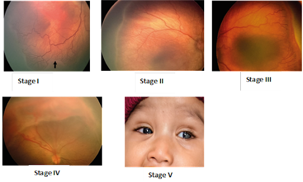

# Retinopathy of Prematurity Stage III Diagnosis

## Project summary

This PhD research developed an hybrid model combining the use of morphological operations and a Convolutional Neural Network (CNN) for ROP stage III disease diagnosis.

Retinopathy of Prematurity (ROP) is an eye disease which affects newborn babies born preterm.

Babies born preterm, have their retina not fully developed and, in some cases, the blood vessels begins to grow abnormally.

## Project structure

The project has the following structure:
- `codes/`: codes with modules and functions implementing preprocessing, datasets, model and utilities.
- `notebooks/`: notebooks covering different project stages: data preparation, modeling and ensembling.
- `figures/`:
- `input/`:
- `models/`:
- `submissions/`:

## Requirements

To run the project codes, you can....:
